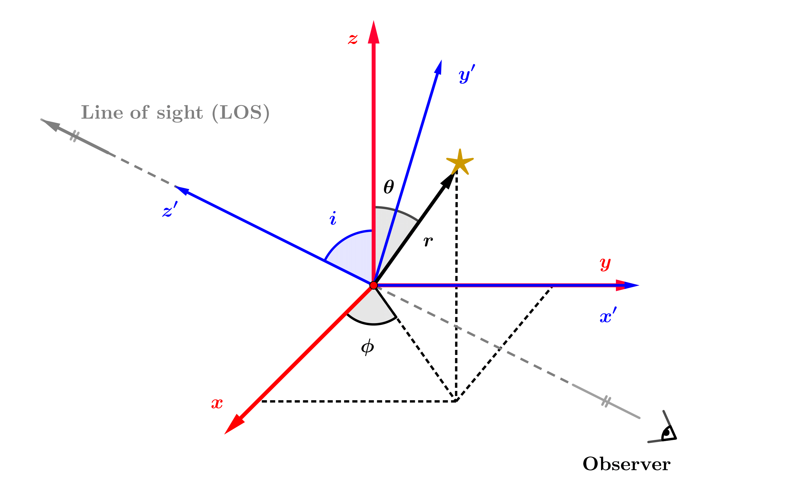

# PLANE OF SKY VELOCITY MOMENTS (POSr AND POSt)

In the current section, we aim to extend their formalism to proper motions, 
providing the corresponding equations in the POS. 
For that, we first need to set the general geometric conventions adopted. 
We suppose a flattened system originally represented in spherical coordinates 
$(r, \theta, \phi)$, related to a general Cartesian frame $(x, y, z)$ 
which is inclined by and angle $i$, such that the new coordinate system becomes 
$(x', y', z')$, with $z'$ being defined as the LOS direction. 
We use the inclination definition from [Evans & de Zeeuw (1994)]() (eqs. A1), 
which set the correspondences below (see also Figure):

  

$x' = y$.\
$y' = -x \cos(i) + z \sin(i)$.\
$z' = x \sin(i) + z \cos(i)$.

The only new considerations that need to be made to account for 
proper motions is to write the new velocity dimensions $v_{\mathrm{dim}}$ 
as a combination of radial, tangential and azimuthal components, 
such as performed in 
[De Bruijne et al. (1996)](https://ui.adsabs.harvard.edu/abs/1996MNRAS.282..909D/abstract)
for the LOS direction, hereafter written as $z'$:

$v_{z'} = C_{r} v_{r} + C_{\theta} v_{\theta} + C_{\phi} v_{\phi}$.

where the $C_{\mathrm{i}}$ terms are given by their eqs. 49:

$C_{r, \mathrm{LOS}} = \sin (\theta ) \sin (i) \cos (\phi )+\cos (\theta ) \cos (i)$.\
$C_{\theta, \mathrm{LOS}} =\cos (\theta ) \sin (i) \cos (\phi )-\sin (\theta ) \cos (i)$.\
$C_{\phi, \mathrm{LOS}} = -\sin (i) \sin (\phi )$.

The proper motion directions in the radial and tangential directions can be written as:

$v_{\mathrm{POSr}} = \displaystyle{\frac{x' v_{x'} + y' v_{y'}}{\sqrt{x'^{2} + y'^{2}}}}$.

$v_{\mathrm{POSt}} = \displaystyle{\frac{y' v_{x'} - x' v_{y'}}{\sqrt{x'^{2} + y'^{2}}}}$.

From those relations, it follows that the $C_{\mathrm{i}}$ terms for the POSr and POSt directions are, respectively:

>$v_{\mathrm{POSr}}$:

$C_{r, \mathrm{POSr}} = \sqrt{\sin ^2(\theta ) \sin ^2(\phi )+(\cos (\theta ) \sin (i)-\sin (\theta ) \cos (i) \cos (\phi ))^2}$.

$C_{\theta, \mathrm{POSr}} = (\sin (\theta ) \cos (\theta ) \cos ^2(i) \cos ^2(\phi )+\sin (\theta ) \cos (\theta ) \left(\sin ^2(\phi )-\sin ^2(i)\right)-\cos(2 \theta ) \sin (i) \cos (i) \cos (\phi )) / C_{r, \mathrm{POSr}}$.

$C_{\phi, \mathrm{POSr}} = (\sin (\phi ) \left(\sin (\theta ) \cos (\phi )+\sin (\theta ) \cos ^2(i) (-\cos (\phi ))+\cos (\theta ) \sin (i) \cos(i)\right))/C_{r, \mathrm{POSr}}$.

>$v_{\mathrm{POSt}}$:

$C_{r} = 0$.

$C_{\theta} = (\sin (i) \sin (\phi ))/C_{r, \mathrm{POSr}}$.

$C_{\phi} = (\cos (\theta ) \sin (i) \cos (\phi )-\sin (\theta ) \cos (i))/C_{r, \mathrm{POSr}}$.

These coefficients are then applied to equation (50) from 
[De Bruijne et al. (1996)](https://ui.adsabs.harvard.edu/abs/1996MNRAS.282..909D/abstract):

$\rho\left<v_{\mathrm{dim}}^{n}\right> = \sum_{j = 0}^{n} \sum_{k = 0}^{n - j} \left(\substack{n \\ j}\right) \left(\substack{n - j \\ k}\right) C_{r}^{j} C_{\theta}^{k} C_{\phi}^{n-j-k} \rho\left<v_{r}^{j} v_{\theta}^{k} v_{\phi}^{n-j-k}\right>$.

to recover the velocity moments in each direction (LOS, POSr and POSt).